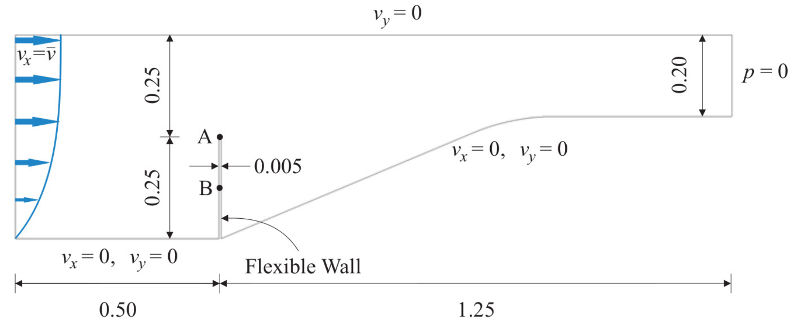
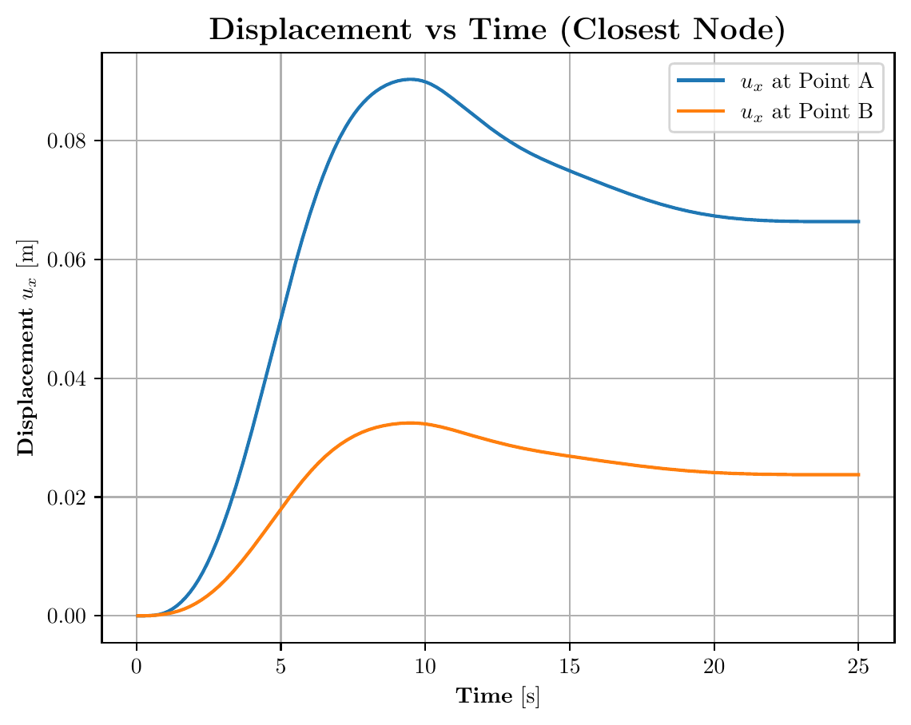

# Mok FSI Benchmark

## Description and Specification

This example is a 2D FSI simulation of the renowned Mok benchmark test. It consists of a 2D convergent fluid channel that contains a flexible wall structure attached to its bottom wall. The main challenge of the test is that the densities of the fluid and the structure have a similar order of magnitude, leading to a strongly coupled problem in where large interaction between the two fields appears.

The problem geometry as well as the boundary conditions are sketched below:



The fluid domain is modelled as a Newtonian fluid with a density of $\rho_f = 956$ $kg/m³$ and a kinematic viscosity of $\nu_f = 1.5167\times10^{-4}$ $m²/s$. A time-dependent parabolic velocity profile is prescribed at the inlet. The structure is modelled using a linear elastic plane-stress constitutive law with unit thickness, a density of $\rho_s = 1500$ $kg/m3$, a Young’s modulus of $E = 2.3 × 10^6$ $Pa$, and a Poisson’s ratio of
$\nu_s = 0.45$. The simulation is performed with a time step of $\Delta t = 0.1$ $s$ and a total simulation time of 25 s.
The fluid domain was set up in OpenFOAM using the ```blockMesh``` utility. The co-simulation was then performed using the adapter developed in this project. Points A and B of consideration locate at the top and middle of the flexible wall, respectively.

## Results

The obtained displacement of points A and B with respect to time is plotted as follows:



## References

D.P. Mok. Partitionierte Lösungsansätze in der Strukturdynamik und der Fluid−Struktur−Interaktion. PhD thesis: Institut für Baustatik, Universität Stuttgart, 2001. [http://dx.doi.org/10.18419/opus-147](http://dx.doi.org/10.18419/opus-147)

G. Valdés. Nonlinear Analysis of Orthotropic Membrane and Shell Structures Including Fluid-Structure Interaction. PhD thesis: Universitat Politècnica de Catalunya, 2007. [http://www.tdx.cat/handle/10803/6866](http://www.tdx.cat/handle/10803/6866)