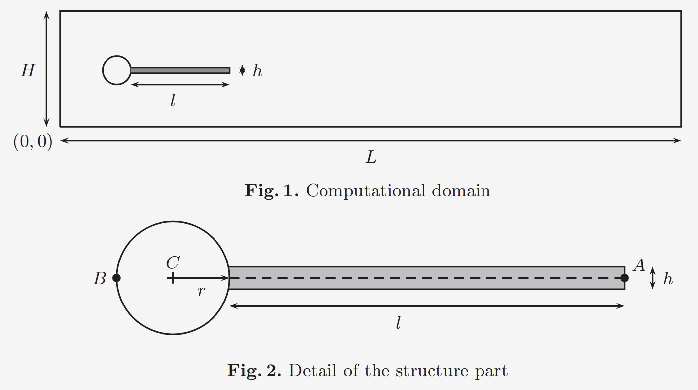
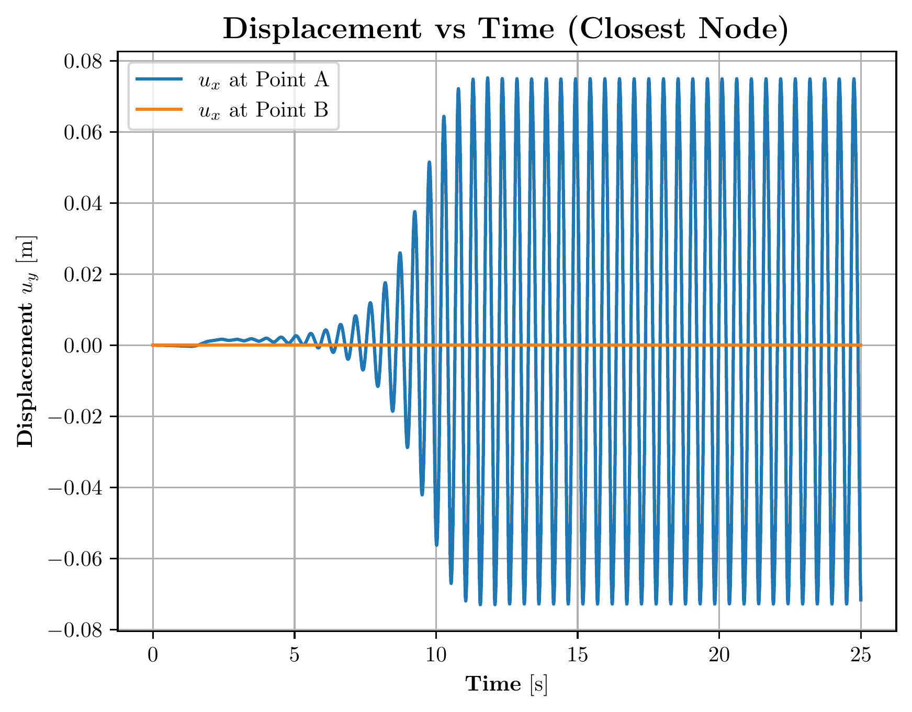

# Turek FSI Benchmark

## Description and Specification

This example is a 2D FSI simulation of the renowned Turek benchmark test. It consists of an incompressible laminar flow through a channel containing a circular cylinder wih an attached flexible elastic structure (see below).

The channel has a length of $2.5$ $m$ and height of $0.41$ $m$. The cylinder has a radius of $0.05$ $m$ and is centered at $(0.2,$ $0.2)$. The elastic structure is $0.35$ $m$ long and $0.02$ $m$ thick, and is attached to the rear of the cylinder.

A parabolic velocity profile is prescribed at the inlet, with a smooth ramp-up during the first $2$ $s$. A stress-free or equivalent outflow condition is applied at the outlet, while no-slip conditions are imposed on the channel walls, the cylinder, and the fluid-structure interface. The interaction between the fluid and the elastic structure leads to self-induced oscillations of the structure, making the benchmark suitable for evaluating FSI solvers.

Points A and B of consideration locate at the tip of the flexible structure and the left most point of the cylinder, respectively.

## Results

The resulting displacement in $y$ direction $u_y$ of both points A and B is plotted as follows:

## References
Turek S., Hron J. (2006) Proposal for Numerical Benchmarking of Fluid-Structure Interaction between an Elastic Object and Laminar Incompressible Flow. In: Bungartz HJ., Schäfer M. (eds) Fluid-Structure Interaction. Lecture Notes in Computational Science and Engineering, vol 53. Springer, Berlin, Heidelberg. [https://doi.org/10.1007/3-540-34596-5_15](https://doi.org/10.1007/3-540-34596-5_15)
